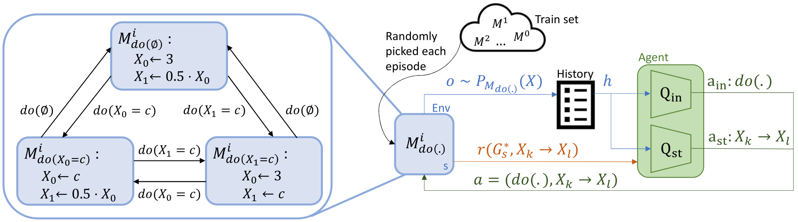

# CORE: Towards Scalable and Efficient Causal Discovery with Reinforcement Learning



This repository contains all code and data to train a CORE model. Furthermore, it contains the trained models that are 
presented in the paper and instruction on how to reproduce the results.

## Installation Requirements
To run this codebase you need the following requirements:
* Python 3.9
* Pytorch (version 1.13 + CUDA 11.7)
* Wandb 0.14.2

Additionally, make sure to `pip install -r requirements.txt`

## Training Data
You can find the graphs on which our models were trained and tested in the `"data/"` folder. The functions
that were used to sample the SCMs from these graphs can be found in `"envs/generation/functions.py"`. For 
adding new functions, simply define one in this file. Make sure to also add the new function to the set 
of possible functions in the `"scm_gen.py"` file.

You can also generate your own graphs data by running the `"generate_graph_data.py"` script. For example, to 
a dataset of 1000 training graphs and 100 testing graphs with 5 variables, you can run:

`python generate_graph_data.py --n-train-graphs 1000 --n-test-graphs 100 --n-endo 5 --method ER --edge-probability 0.2 --save-dir [PATH]`

## Trained Models
The models that were trained in the paper can be found in the `"exp/"` folder. The folder name within the folder 
that defines the graph size, tells you which function the model was trained on. E.g. `"exp/5var/lin_nonoise_20` contains 
the model that was trained on SCMs with linear-additive functions, no noise, and an intervention value of 20. 

To test these models, modify the data-paths in `"evaluation.py"`, to load the model you are interested in.

## Training your own Model
You can train your own model with the "train.py" scipt as follows:

`python train.py  --possible-functions linear --total-steps 1000000 --ep-length 5  --interv-value 20 --test-set [PATH] --save-dir [SAVE_PATH] --train-set [PATH]`

Where `--possible-functions` defines the function classes on which to train, `--ep-length` the number of steps/samples 
per SCM, and `--interv-value` the values for each hard intervention. `--test-set` and `--train-set` are the path to the
test and train set of DAGs, respectively. Make sure to also check the other parameters to influence your training 
behaviour/performance.

## Citing this Work
If you use this code for your own work, please consider citing us:

````
@inproceedings{sauter2024CORE,
  title={CORE: Towards Scalable and Efficient Causal Discovery with Reinforcement Learning},
  author={Sauter, Andreas and Botteghi, Nicolò, and Acar, Erman and Plaat, Aske},
  booktitle={Proceedings of the 2024 International Conference on Autonomous Agents and Multiagent Systems},
  year={2024}
}
````
